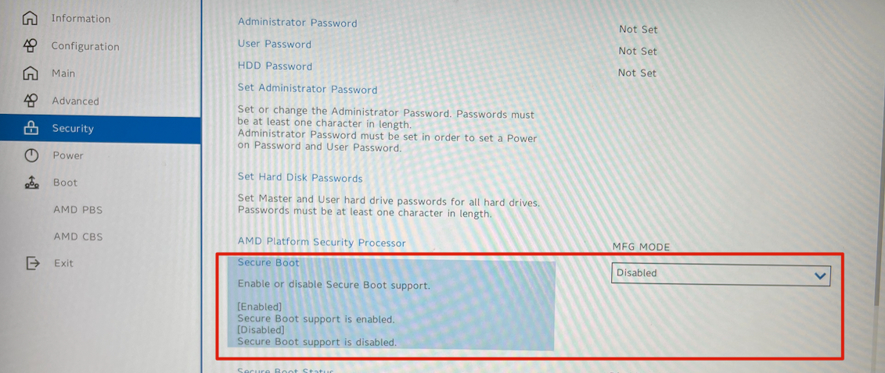
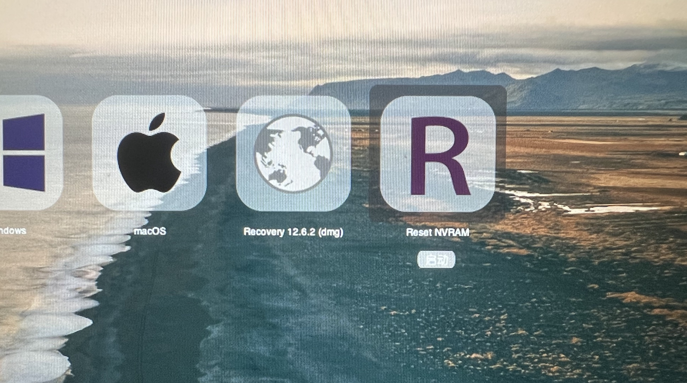
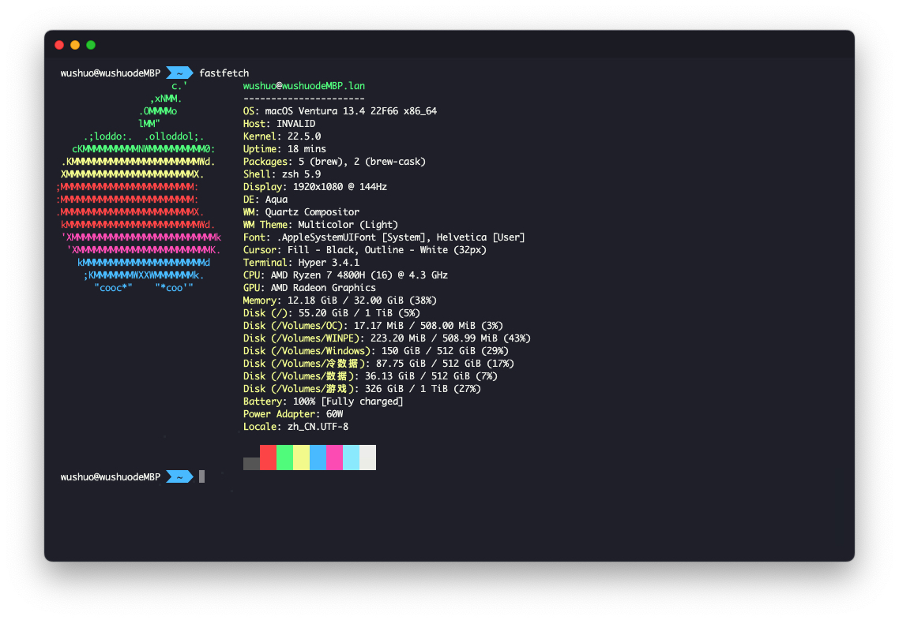

## 　R7000P/R7000 2020 黑苹果

| 名称         | 型号                | 状态                 |
| ------------ | ------------------- | -------------------- |
| 机型         | R7000P / R7000 2020 |                      |
| CPU          | AMD Ryzen™ 7 4800H  | 可用                 |
| 核显         | AMD Radeon Graphics | 可用                 |
| 独显         | NVIDIA RTX 2060 | 不可用                 |
| 网卡         | AX200               | 部分可用(打算换个免驱网卡) |
| 固态         | SN750 4T(原装的海力士和黑苹果不兼容) | 可用                 |
| 键盘、触控板 |                     | 可用                 |
| 声卡、音频   | Realtek ALC257      | 可用                 |
| 内存         | 三星16G x2          | 可用                 |
| USB          |                     | 已经禁用A口一个和C口一个，不然无法进入系统 |
| HDMI          |                     | 不可用 |

EFI下载：

[Releases](https://github.com/W2725730722/Lenovo-R7000P-2020-Hackintosh/releases)

[百度网盘](https://pan.baidu.com/s/17imiltH9gtgzVnm6l66AZQ?pwd=xzev)

### 1 制作启动盘

#### 1.1 刷写macOS安装镜像

使用 [etcher](https://github.com/balena-io/etcher) 把 macOS镜像 写入U盘

#### 1.2 制作启动分区

使用 [diskgenius](https://www.diskgenius.cn) 划分一个 OpenCore 分区(建议最少500m)，格式化为FAT32。

把的EFI解压到 OpenCore 分区。(也可以先在U盘做一个 OpenCore 分区，装完系统后记得移动)

#### 1.3 划分 macOS 安装分区

划分一个分区留作 **macOS的系统分区**，格式随意，大小自己把握。我划分了1T

### 2 安装黑苹果

#### 2.1 禁用核显驱动

使用 [OCAuxiliaryTools](https://github.com/ic005k/OCAuxiliaryTools) 禁用核显，保存。 (每次安装或升级系统都需要禁用)

#### 2.2 关闭安全启动

重启按 F2 进入BIOS

<u>Security</u> > <u>Secure Boot</u>

#### 2.3 开始安装

重启选择启动项 OpenCore

##### 2.3.1 EB错误

这个错误多重启几次就好了，我目前没有解决方法

#### 2.4 抹掉分区

进入安装系统后点击 **磁盘工具** 抹掉刚刚给 macOS 划分的分区 ，格式选择 **APFS**

(这个图片是我随便找的虚拟机安装截图，不过操作都是一样的)

开始安装，分区选择**刚刚抹掉的分区**，安装完成后配置好用户进入桌面

#### 2.5 进入系统

重启进入 pe 或 windows 使用 [OCAuxiliaryTools](https://github.com/ic005k/OCAuxiliaryTools) 启用核显，保存。

再次重启进入 OpenCore 引导，Reset NVRAM 进入macOS (每次修改配置后都要记得Reset NVRAM)

### 3 完工

### 4 修改核显的显存

**==解锁修改显存并没有明显提升，最多只能修改为1G，且需要解锁BIOS。如果BIOS版本较新的需要降级，并存在一定风险==**

**==解锁修改显存并没有明显提升，最多只能修改为1G，且需要解锁BIOS。如果BIOS版本较新的需要降级，并存在一定风险==**

**==解锁修改显存并没有明显提升，最多只能修改为1G，且需要解锁BIOS。如果BIOS版本较新的需要降级，并存在一定风险==**

解锁BIOS需要使用 [Unlocker.exe](https://winraid.level1techs.com/t/tool-lenovo-h20-bios-unlocker-and-locker/38150) 解锁BIOS的高级选项，右键管理员运行即可。解锁后的效果：

若是没有这两个选项那就说明你的BIOS太新了，需要对BIOS进行降级。

**==如果有这两个选项你的BIOS就不需要降级了，请略过==**。

**==如果有这两个选项你的BIOS就不需要降级了，请略过==**。

**==如果有这两个选项你的BIOS就不需要降级了，请略过==**。

##### 4.0.1 BIOS降级

**降级有风险！！！请考虑好再试**。本人因降级BIOS时操作不当，导致BIOS电脑无法开机，遂去售后**200**块解决(已经过保)。

**===降级前请确认你有一台可以使用HDMI连接的显示器==**

**===降级前请确认你有一台可以使用HDMI连接的显示器==**

**===降级前请确认你有一台可以使用HDMI连接的显示器==**

在BIOS开启允许降级：

[下载降级的BIOS](https://download.lenovo.com/consumer/mobiles/fscn20ww.exe)

右键管理员运行，等待电脑自动重启跑进度条。

**等待BIOS降级完成后，如果你的电脑黑屏了请不要慌，请按照以下操作解决**：

用HDMI连接外接显示器进入BIOS，你会发现显卡是独显模式。把它改回混合模式即可。

(如果你发现没有模式切换选项多重启一下就会有的，至少我是这么解决的)

现在你再进入系统进行解锁BIOS就可以了

#### 4.1 设置核显显存

按照以下路径与图片设置核显显存（核显似乎对显存的设置有1G的限制）：

<u>AMD CBS</u> > <u>NBIO Common Options</u> > <u>GFX Configuration</u>

